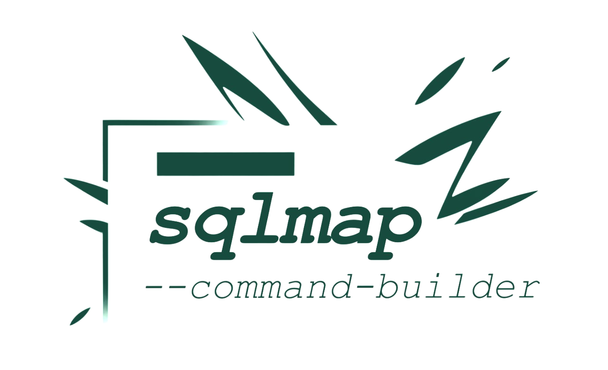

<picture>
  <source media="(prefers-color-scheme: dark)" srcset="./logo-dark.png">
  
</picture>

## <https://vizzdoom.github.io/sqlmap-command-builder/>

**This interactive builder lets you craft advanced SQLMap commands without memorising dozens of switches.**

Project is build with vanila HTML/JS/CSS – it works completely offline and keeps your data private.

## Building

A Python helper script compilies JS and CSS into HTML, creating a single distributable `index.html` file. 

Run:

```bash
python3 build.py
```

The resulting file can be opened directly in your browser or served from any web server. 

Above built artifact is automatically deployed to the project's GitLab Page.

## Use responsibly

_This software is exclusively designed for educational purposes._

_The developer are not liable for any damages or misuse that may result from using this tool._

_You have to accept this term to use or distribute this software._
